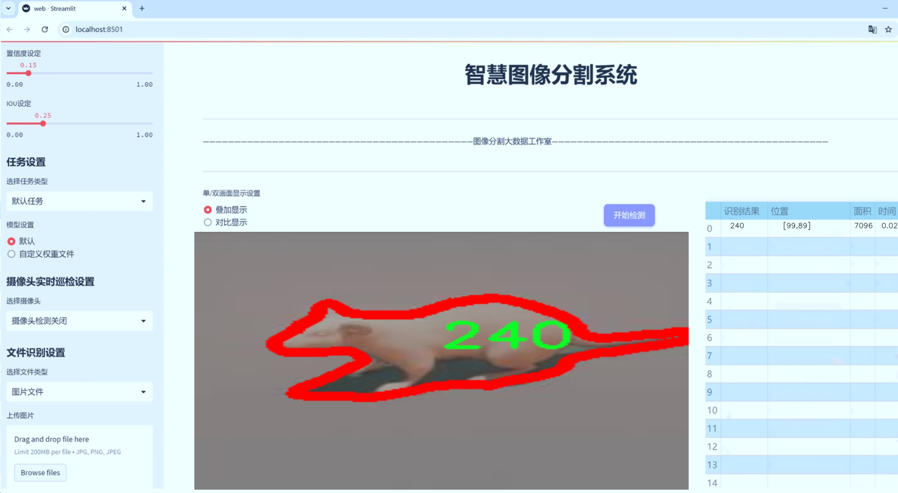
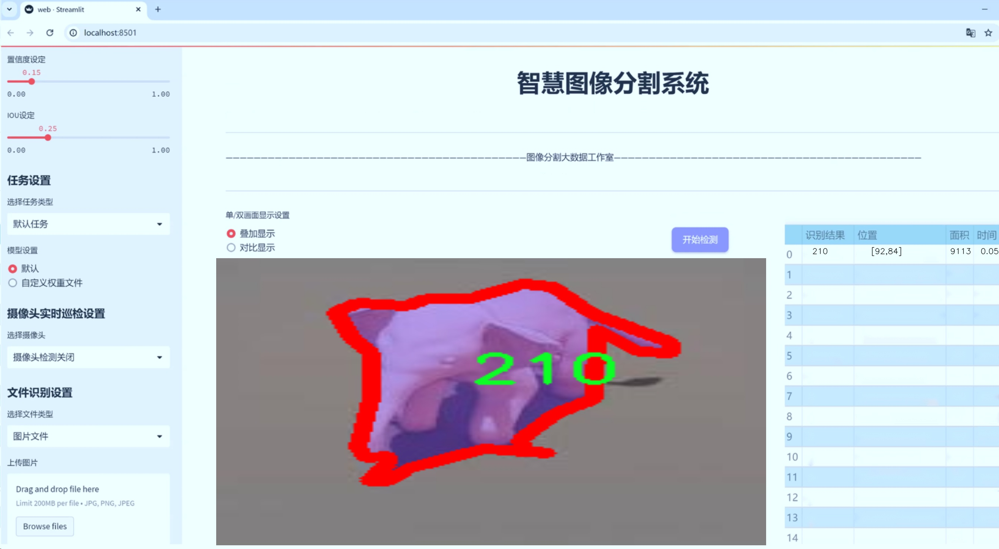
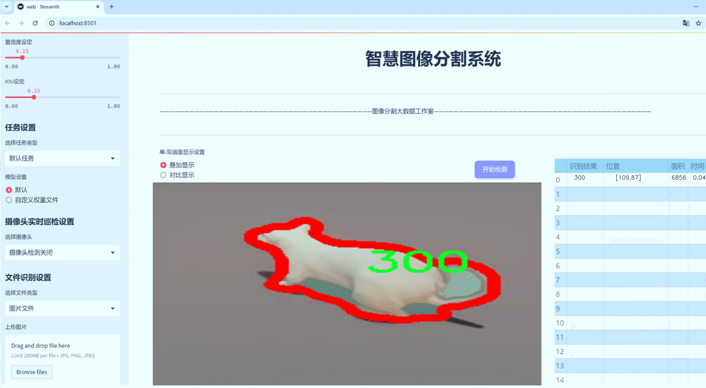
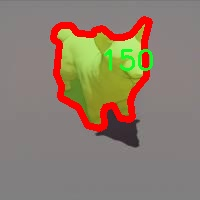
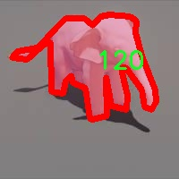
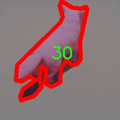
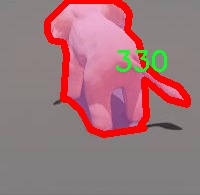
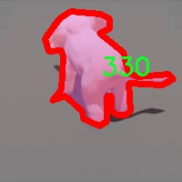

# Github图像验证识别系统源码＆数据集分享
 [yolov8-seg-C2f-Faster-EMA＆yolov8-seg-SPPF-LSKA等50+全套改进创新点发刊_一键训练教程_Web前端展示]

### 1.研究背景与意义

项目参考[ILSVRC ImageNet Large Scale Visual Recognition Challenge](https://gitee.com/YOLOv8_YOLOv11_Segmentation_Studio/projects)

项目来源[AAAI Global Al lnnovation Contest](https://kdocs.cn/l/cszuIiCKVNis)

研究背景与意义

随着人工智能技术的迅猛发展，计算机视觉领域的应用日益广泛，尤其是在图像识别和目标检测方面。YOLO（You Only Look Once）系列模型因其高效性和实时性，成为了目标检测领域的重要工具。YOLOv8作为该系列的最新版本，结合了深度学习的先进技术，进一步提升了检测精度和速度。然而，尽管YOLOv8在许多应用场景中表现出色，但在特定领域，尤其是图像验证和识别系统的构建中，仍然存在一些挑战。

本研究旨在基于改进的YOLOv8模型，构建一个针对Github图像验证的识别系统。Github作为全球最大的开源代码托管平台，拥有海量的图像资源，涵盖了从软件开发到数据科学等多个领域。随着开源项目的不断增加，如何有效地对Github中的图像进行分类和验证，成为了一个亟待解决的问题。现有的图像处理技术往往无法满足这一需求，特别是在处理复杂场景和多类别图像时，识别准确率和效率均显得不足。因此，基于YOLOv8的改进，开发一个高效的图像验证识别系统，具有重要的学术价值和实际意义。

在本研究中，我们将使用一个包含1800张图像的数据集，该数据集涵盖了12个类别，具体包括120、150、180、210、240、270、30、300、330、360、60和90等不同的类目。这些类别的多样性使得图像验证系统的设计和实现面临更大的挑战。通过对这些图像进行实例分割，我们能够更精确地识别出图像中的各个对象，从而提高系统的整体性能。此外，针对YOLOv8模型的改进将集中在网络结构的优化、数据增强技术的应用以及训练策略的调整等方面，以期在保持实时性的同时，进一步提升识别精度。

本研究的意义不仅在于推动计算机视觉技术的发展，更在于为Github平台上的图像资源管理提供一种有效的解决方案。通过构建高效的图像验证识别系统，开发者和用户能够更快速地找到所需的图像资源，进而提高工作效率。此外，该系统的成功实施还将为其他开源平台的图像管理提供借鉴，推动相关领域的研究和应用。

综上所述，基于改进YOLOv8的Github图像验证识别系统的研究，不仅具有重要的理论价值，还具备广泛的应用前景。通过对图像识别技术的深入探索，我们期望能够为开源社区的可持续发展贡献一份力量，同时为计算机视觉领域的研究提供新的思路和方法。

### 2.图片演示







##### 注意：由于此博客编辑较早，上面“2.图片演示”和“3.视频演示”展示的系统图片或者视频可能为老版本，新版本在老版本的基础上升级如下：（实际效果以升级的新版本为准）

  （1）适配了YOLOV8的“目标检测”模型和“实例分割”模型，通过加载相应的权重（.pt）文件即可自适应加载模型。

  （2）支持“图片识别”、“视频识别”、“摄像头实时识别”三种识别模式。

  （3）支持“图片识别”、“视频识别”、“摄像头实时识别”三种识别结果保存导出，解决手动导出（容易卡顿出现爆内存）存在的问题，识别完自动保存结果并导出到tempDir中。

  （4）支持Web前端系统中的标题、背景图等自定义修改，后面提供修改教程。

  另外本项目提供训练的数据集和训练教程,暂不提供权重文件（best.pt）,需要您按照教程进行训练后实现图片演示和Web前端界面演示的效果。

### 3.视频演示

[3.1 视频演示](https://www.bilibili.com/video/BV1psmGYwEPD/)

### 4.数据集信息展示

##### 4.1 本项目数据集详细数据（类别数＆类别名）

nc: 12
names: ['120', '150', '180', '210', '240', '270', '30', '300', '330', '360', '60', '90']


##### 4.2 本项目数据集信息介绍

数据集信息展示

在本研究中，我们使用的数据集名为“24907r598327803081309-”，该数据集专门为改进YOLOv8-seg的图像验证识别系统而设计。数据集的构建旨在提供丰富且多样化的图像样本，以增强模型在实际应用中的表现和准确性。数据集包含12个类别，分别为‘120’，‘150’，‘180’，‘210’，‘240’，‘270’，‘30’，‘300’，‘330’，‘360’，‘60’和‘90’。这些类别代表了不同的目标对象或场景，能够帮助模型在多种情况下进行有效的识别和分类。

数据集的设计考虑到了图像的多样性和复杂性，以确保模型在训练过程中能够接触到广泛的样本。每个类别都包含大量的图像，这些图像在拍摄时考虑到了不同的光照条件、角度和背景，以模拟真实世界中的应用场景。例如，类别‘120’可能代表某种特定的物体，而在数据集中，该物体可能在不同的环境中出现，如室内、室外、白天和夜晚等。这种多样性不仅增强了模型的鲁棒性，还提高了其在未知数据上的泛化能力。

在数据集的构建过程中，我们特别关注了图像的标注质量。每张图像都经过仔细的标注，确保目标对象的边界框和类别标签的准确性。这种高质量的标注对于训练深度学习模型至关重要，因为它直接影响到模型的学习效果和最终的识别精度。此外，数据集还经过了预处理，以确保图像的统一性和标准化，使得模型在训练时能够更快地收敛。

为了评估模型的性能，我们将数据集划分为训练集和验证集。训练集用于模型的训练，而验证集则用于评估模型在未见数据上的表现。这种划分方法能够有效地防止模型的过拟合，确保其在实际应用中的可靠性和有效性。通过不断迭代和优化，我们期望在YOLOv8-seg的基础上，进一步提升图像识别的准确性和效率。

在数据集的使用过程中，我们还考虑到了数据增强技术的应用。通过对图像进行旋转、缩放、裁剪和颜色调整等操作，我们能够生成更多的训练样本，从而丰富数据集的多样性。这种数据增强策略不仅提高了模型的鲁棒性，还有效地扩展了训练数据的规模，为模型的训练提供了更为丰富的特征信息。

综上所述，数据集“24907r598327803081309-”为改进YOLOv8-seg的图像验证识别系统提供了坚实的基础。通过精心设计的类别结构、严格的标注质量和有效的数据增强策略，我们期望该数据集能够在模型训练中发挥重要作用，推动图像识别技术的进一步发展和应用。











### 5.全套项目环境部署视频教程（零基础手把手教学）

[5.1 环境部署教程链接（零基础手把手教学）](https://www.bilibili.com/video/BV1jG4Ve4E9t/?vd_source=bc9aec86d164b67a7004b996143742dc)


[5.2 安装Python虚拟环境创建和依赖库安装视频教程链接（零基础手把手教学）](https://www.bilibili.com/video/BV1nA4VeYEze/?vd_source=bc9aec86d164b67a7004b996143742dc)

### 6.手把手YOLOV8-seg训练视频教程（零基础小白有手就能学会）

[6.1 手把手YOLOV8-seg训练视频教程（零基础小白有手就能学会）](https://www.bilibili.com/video/BV1cA4VeYETe/?vd_source=bc9aec86d164b67a7004b996143742dc)


按照上面的训练视频教程链接加载项目提供的数据集，运行train.py即可开始训练



     Epoch   gpu_mem       box       obj       cls    labels  img_size
     1/200     0G   0.01576   0.01955  0.007536        22      1280: 100%|██████████| 849/849 [14:42<00:00,  1.04s/it]
               Class     Images     Labels          P          R     mAP@.5 mAP@.5:.95: 100%|██████████| 213/213 [01:14<00:00,  2.87it/s]
                 all       3395      17314      0.994      0.957      0.0957      0.0843

     Epoch   gpu_mem       box       obj       cls    labels  img_size
     2/200     0G   0.01578   0.01923  0.007006        22      1280: 100%|██████████| 849/849 [14:44<00:00,  1.04s/it]
               Class     Images     Labels          P          R     mAP@.5 mAP@.5:.95: 100%|██████████| 213/213 [01:12<00:00,  2.95it/s]
                 all       3395      17314      0.996      0.956      0.0957      0.0845

     Epoch   gpu_mem       box       obj       cls    labels  img_size
     3/200     0G   0.01561    0.0191  0.006895        27      1280: 100%|██████████| 849/849 [10:56<00:00,  1.29it/s]
               Class     Images     Labels          P          R     mAP@.5 mAP@.5:.95: 100%|███████   | 187/213 [00:52<00:00,  4.04it/s]
                 all       3395      17314      0.996      0.957      0.0957      0.0845


### 7.50+种全套YOLOV8-seg创新点代码加载调参视频教程（一键加载写好的改进模型的配置文件）

[7.1 50+种全套YOLOV8-seg创新点代码加载调参视频教程（一键加载写好的改进模型的配置文件）](https://www.bilibili.com/video/BV1Hw4VePEXv/?vd_source=bc9aec86d164b67a7004b996143742dc)

### 8.YOLOV8-seg图像分割算法原理

原始YOLOv8-seg算法原理

YOLOv8-seg算法是YOLO系列的最新版本之一，旨在实现高效的目标检测与图像分割。该算法在YOLOv8的基础上，结合了图像分割的需求，采用了一系列创新的设计理念和技术，使其在准确性和速度上都取得了显著的提升。YOLOv8-seg的核心思想是将目标检测与图像分割任务整合为一个统一的框架，通过共享特征提取网络来提高效率，并通过解耦的方式增强模型的专注性，从而在复杂场景中实现更高的定位精度和分类准确率。

YOLOv8-seg的网络结构由主干网络（backbone）、特征增强网络（neck）和检测头（head）三部分组成。主干网络采用了CSPNet的设计思想，通过C2F模块来提取图像的多层次特征。C2F模块的引入使得网络能够并行处理更多的梯度流分支，从而在保持轻量化的同时获得更丰富的特征信息。这种结构的优势在于，它能够有效地捕捉到图像中的细节特征，为后续的目标检测和分割任务提供了强有力的支持。

在特征增强网络部分，YOLOv8-seg采用了PAN-FPN的思想，通过自底向上的特征融合来提升特征的表达能力。特征增强网络不仅能够有效地整合来自不同层次的特征信息，还能增强模型对不同尺度目标的检测能力。这一设计使得YOLOv8-seg在处理复杂场景时，能够更好地应对目标大小和形状的变化，从而提高整体的检测性能。

检测头部分是YOLOv8-seg的关键所在。与传统的耦合头不同，YOLOv8-seg采用了解耦头的设计，将目标分类和边界框回归任务分为两个独立的分支。这种解耦的方式使得每个任务能够更加专注于自身的目标，减少了任务之间的干扰，从而提高了模型在复杂场景下的表现。此外，YOLOv8-seg在损失函数的设计上也进行了创新，采用了DFL（Distribution Focal Loss）和CIoU（Complete Intersection over Union）损失函数，旨在快速聚焦于标签附近的区域，提高预测的准确性。

YOLOv8-seg还引入了Anchor-free的目标检测方法，摒弃了传统的Anchor-based方法。这一转变使得模型不再依赖于预设的锚框，而是通过直接回归目标的位置和大小来实现目标检测。这种方法的优势在于，它减少了对锚框的依赖，使得模型在处理不同尺度和形状的目标时更加灵活。此外，Anchor-free方法还简化了模型的设计，提升了计算效率，适合在实时检测场景中应用。

在输入处理方面，YOLOv8-seg采用了自适应图像缩放技术，以提高目标检测和推理的速度。通过将图像的长边按比例缩小到指定尺寸，并对短边进行填充，YOLOv8-seg能够有效减少信息冗余，保持目标的完整性。同时，在训练过程中，YOLOv8-seg还使用了Mosaic数据增强技术，通过随机拼接多张图像来生成新的训练样本，增强了模型的泛化能力。

总的来说，YOLOv8-seg算法在YOLOv8的基础上，融合了目标检测与图像分割的优势，通过创新的网络结构和高效的特征处理方式，显著提升了模型的性能。其解耦的检测头设计、Anchor-free的目标检测方法以及自适应的输入处理方式，使得YOLOv8-seg在实时目标检测和图像分割任务中表现出色，成为计算机视觉领域的重要工具。随着技术的不断进步，YOLOv8-seg有望在更多实际应用中发挥重要作用，推动目标检测和图像分割技术的发展。


### 9.系统功能展示（检测对象为举例，实际内容以本项目数据集为准）

图9.1.系统支持检测结果表格显示

  图9.2.系统支持置信度和IOU阈值手动调节

  图9.3.系统支持自定义加载权重文件best.pt(需要你通过步骤5中训练获得)

  图9.4.系统支持摄像头实时识别

  图9.5.系统支持图片识别

  图9.6.系统支持视频识别

  图9.7.系统支持识别结果文件自动保存

  图9.8.系统支持Excel导出检测结果数据


### 10.50+种全套YOLOV8-seg创新点原理讲解（非科班也可以轻松写刊发刊，V11版本正在科研待更新）

#### 10.1 由于篇幅限制，每个创新点的具体原理讲解就不一一展开，具体见下列网址中的创新点对应子项目的技术原理博客网址【Blog】：


[10.1 50+种全套YOLOV8-seg创新点原理讲解链接](https://gitee.com/qunmasj/good)

#### 10.2 部分改进模块原理讲解(完整的改进原理见上图和技术博客链接)【如果此小节的图加载失败可以通过CSDN或者Github搜索该博客的标题访问原始博客，原始博客图片显示正常】

### YOLOv8简介

按照官方描述，YOLOv8 是一个 SOTA 模型，它建立在以前 YOLO 版本的成功基础上，并引入了新的功能和改进，以进一步提升性能和灵活性。具体创新包括一个新的骨干网络、一个新的 Ancher-Free 检测头和一个新的损失函数，可以在从 CPU 到 GPU 的各种硬件平台上运行。

不过 ultralytics 并没有直接将开源库命名为 YOLOv8，而是直接使用 ultralytics 这个词，原因是 ultralytics 将这个库定位为算法框架，而非某一个特定算法，一个主要特点是可扩展性。其希望这个库不仅仅能够用于 YOLO 系列模型，而是能够支持非 YOLO 模型以及分类分割姿态估计等各类任务。
总而言之，ultralytics 开源库的两个主要优点是：

融合众多当前 SOTA 技术于一体
未来将支持其他 YOLO 系列以及 YOLO 之外的更多算法


下表为官方在 COCO Val 2017 数据集上测试的 mAP、参数量和 FLOPs 结果。可以看出 YOLOv8 相比 YOLOv5 精度提升非常多，但是 N/S/M 模型相应的参数量和 FLOPs 都增加了不少，从上图也可以看出相比 YOLOV5 大部分模型推理速度变慢了。


额外提一句，现在各个 YOLO 系列改进算法都在 COCO 上面有明显性能提升，但是在自定义数据集上面的泛化性还没有得到广泛验证，至今依然听到不少关于 YOLOv5 泛化性能较优异的说法。对各系列 YOLO 泛化性验证也是 MMYOLO 中一个特别关心和重点发力的方向。

### YOLO-MS简介
实时目标检测，以YOLO系列为例，已在工业领域中找到重要应用，特别是在边缘设备（如无人机和机器人）中。与之前的目标检测器不同，实时目标检测器旨在在速度和准确性之间追求最佳平衡。为了实现这一目标，提出了大量的工作：从第一代DarkNet到CSPNet，再到最近的扩展ELAN，随着性能的快速增长，实时目标检测器的架构经历了巨大的变化。

尽管性能令人印象深刻，但在不同尺度上识别对象仍然是实时目标检测器面临的基本挑战。这促使作者设计了一个强大的编码器架构，用于学习具有表现力的多尺度特征表示。具体而言，作者从两个新的角度考虑为实时目标检测编码多尺度特征：

从局部视角出发，作者设计了一个具有简单而有效的分层特征融合策略的MS-Block。受到Res2Net的启发，作者在MS-Block中引入了多个分支来进行特征提取，但不同的是，作者使用了一个带有深度卷积的 Inverted Bottleneck Block块，以实现对大Kernel的高效利用。

从全局视角出发，作者提出随着网络加深逐渐增加卷积的Kernel-Size。作者在浅层使用小Kernel卷积来更高效地处理高分辨率特征。另一方面，在深层中，作者采用大Kernel卷积来捕捉广泛的信息。

基于以上设计原则，作者呈现了作者的实时目标检测器，称为YOLO-MS。为了评估作者的YOLO-MS的性能，作者在MS COCO数据集上进行了全面的实验。还提供了与其他最先进方法的定量比较，以展示作者方法的强大性能。如图1所示，YOLO-MS在计算性能平衡方面优于其他近期的实时目标检测器。


具体而言，YOLO-MS-XS在MS COCO上获得了43%+的AP得分，仅具有450万个可学习参数和8.7亿个FLOPs。YOLO-MS-S和YOLO-MS分别获得了46%+和51%+的AP，可学习参数分别为810万和2220万。此外，作者的工作还可以作为其他YOLO模型的即插即用模块。通常情况下，作者的方法可以将YOLOv8的AP从37%+显著提高到40%+，甚至还可以使用更少的参数和FLOPs。


#### Multi-Scale Building Block Design
CSP Block是一个基于阶段级梯度路径的网络，平衡了梯度组合和计算成本。它是广泛应用于YOLO系列的基本构建块。已经提出了几种变体，包括YOLOv4和YOLOv5中的原始版本，Scaled YOLOv4中的CSPVoVNet，YOLOv7中的ELAN，以及RTMDet中提出的大Kernel单元。作者在图2(a)和图2(b)中分别展示了原始CSP块和ELAN的结构。


上述实时检测器中被忽视的一个关键方面是如何在基本构建块中编码多尺度特征。其中一个强大的设计原则是Res2Net，它聚合了来自不同层次的特征以增强多尺度表示。然而，这一原则并没有充分探索大Kernel卷积的作用，而大Kernel卷积已经在基于CNN的视觉识别任务模型中证明有效。将大Kernel卷积纳入Res2Net的主要障碍在于它们引入的计算开销，因为构建块采用了标准卷积。在作者的方法中，作者提出用 Inverted Bottleneck Block替代标准的3 × 3卷积，以享受大Kernel卷积的好处。

基于前面的分析，作者提出了一个带有分层特征融合策略的全新Block，称为MS-Block，以增强实时目标检测器在提取多尺度特征时的能力，同时保持快速的推理速度。

MS-Block的具体结构如图2(c)所示。假设是输入特征。通过1×1卷积的转换后，X的通道维度增加到n*C。然后，作者将X分割成n个不同的组，表示为，其中。为了降低计算成本，作者选择n为3。

注意，除了之外，每个其他组都经过一个 Inverted Bottleneck Block层，用表示，其中k表示Kernel-Size，以获得。的数学表示如下：


根据这个公式，该博客的作者不将 Inverted Bottleneck Block层连接，使其作为跨阶段连接，并保留来自前面层的信息。最后，作者将所有分割连接在一起，并应用1×1卷积来在所有分割之间进行交互，每个分割都编码不同尺度的特征。当网络加深时，这个1×1卷积也用于调整通道数。

#### Heterogeneous Kernel Selection Protocol
除了构建块的设计外，作者还从宏观角度探讨了卷积的使用。之前的实时目标检测器在不同的编码器阶段采用了同质卷积（即具有相同Kernel-Size的卷积），但作者认为这不是提取多尺度语义信息的最佳选项。

在金字塔结构中，从检测器的浅阶段提取的高分辨率特征通常用于捕捉细粒度语义，将用于检测小目标。相反，来自网络较深阶段的低分辨率特征用于捕捉高级语义，将用于检测大目标。如果作者在所有阶段都采用统一的小Kernel卷积，深阶段的有效感受野（ERF）将受到限制，影响大目标的性能。在每个阶段中引入大Kernel卷积可以帮助解决这个问题。然而，具有大的ERF的大Kernel可以编码更广泛的区域，这增加了在小目标外部包含噪声信息的概率，并且降低了推理速度。

在这项工作中，作者建议在不同阶段中采用异构卷积，以帮助捕获更丰富的多尺度特征。具体来说，在编码器的第一个阶段中，作者采用最小Kernel卷积，而最大Kernel卷积位于最后一个阶段。随后，作者逐步增加中间阶段的Kernel-Size，使其与特征分辨率的增加保持一致。这种策略允许提取细粒度和粗粒度的语义信息，增强了编码器的多尺度特征表示能力。

正如图所示，作者将k的值分别分配给编码器中的浅阶段到深阶段，取值为3、5、7和9。作者将其称为异构Kernel选择（HKS）协议。


作者的HKS协议能够在深层中扩大感受野，而不会对浅层产生任何其他影响。此外，HKS不仅有助于编码更丰富的多尺度特征，还确保了高效的推理。

如表1所示，将大Kernel卷积应用于高分辨率特征会产生较高的计算开销。然而，作者的HKS协议在低分辨率特征上采用大Kernel卷积，从而与仅使用大Kernel卷积相比，大大降低了计算成本。


在实践中，作者经验性地发现，采用HKS协议的YOLO-MS的推理速度几乎与仅使用深度可分离的3 × 3卷积相同。

#### Architecture
如图所示，作者模型的Backbone由4个阶段组成，每个阶段后面跟随1个步长为2的3 × 3卷积进行下采样。在第3个阶段后，作者添加了1个SPP块，与RTMDet中一样。在作者的编码器上，作者使用PAFPN作为Neck来构建特征金字塔[31, 35]。它融合了从Backbone不同阶段提取的多尺度特征。Neck中使用的基本构建块也是作者的MS-Block，在其中使用3 × 3深度可分离卷积进行快速推理。

此外，为了在速度和准确性之间取得更好的平衡，作者将Backbone中多级特征的通道深度减半。作者提供了3个不同尺度的YOLO-MS变体，即YOLO-MS-XS、YOLO-MS-S和YOLO-MS。不同尺度的YOLO-MS的详细配置列在表2中。对于YOLO-MS的其他部分，作者将其保持与RTMDet相同。


### 11.项目核心源码讲解（再也不用担心看不懂代码逻辑）

#### 11.1 ultralytics\models\yolo\detect\__init__.py

下面是对给定代码的逐行分析和核心部分的保留，同时添加了详细的中文注释：

```python
# Ultralytics YOLO 🚀, AGPL-3.0 license

# 从当前包中导入三个类：DetectionPredictor、DetectionTrainer 和 DetectionValidator
from .predict import DetectionPredictor  # 导入用于目标检测预测的类
from .train import DetectionTrainer      # 导入用于训练目标检测模型的类
from .val import DetectionValidator       # 导入用于验证目标检测模型的类

# 定义当前模块的公共接口，指定可以被外部访问的类
__all__ = 'DetectionPredictor', 'DetectionTrainer', 'DetectionValidator'
```

### 代码分析：
1. **导入模块**：
   - 代码中通过相对导入的方式引入了三个核心类，分别用于目标检测的预测、训练和验证。这些类是实现 YOLO（You Only Look Once）目标检测算法的关键组件。

2. **公共接口**：
   - `__all__` 变量用于定义模块的公共接口，只有在使用 `from module import *` 语句时，列出的类才会被导入。这是一种控制模块导出内容的方式，确保外部用户只访问到指定的类。

### 核心部分：
- 该代码的核心在于三个类的导入和 `__all__` 的定义，确保了模块的结构清晰且易于使用。

这个文件是Ultralytics YOLO项目中的一个初始化文件，通常用于定义模块的公共接口。在这个文件中，首先有一个注释，说明了项目的名称（Ultralytics YOLO）以及其许可证类型（AGPL-3.0）。接下来，文件通过相对导入的方式引入了三个类：`DetectionPredictor`、`DetectionTrainer`和`DetectionValidator`，分别来自于`predict`、`train`和`val`模块。

`DetectionPredictor`类通常用于处理目标检测的预测任务，负责加载模型并对输入数据进行推理，输出检测结果。`DetectionTrainer`类则用于训练模型，包含了训练过程中的各种设置和操作，如数据加载、损失计算和模型更新等。`DetectionValidator`类用于验证模型的性能，通常会在训练后对模型进行评估，以确保其在未见数据上的表现。

最后，`__all__`变量定义了模块的公共接口，表示当使用`from module import *`语句时，只有`DetectionPredictor`、`DetectionTrainer`和`DetectionValidator`这三个类会被导入。这种做法有助于控制模块的可见性，避免不必要的命名冲突，并使得模块的使用更加清晰和简洁。总的来说，这个文件的主要作用是将目标检测相关的功能模块组织在一起，方便其他部分的调用和使用。

#### 11.2 ui.py

```python
import sys
import subprocess

def run_script(script_path):
    """
    使用当前 Python 环境运行指定的脚本。

    Args:
        script_path (str): 要运行的脚本路径

    Returns:
        None
    """
    # 获取当前 Python 解释器的路径
    python_path = sys.executable

    # 构建运行命令，使用 streamlit 运行指定的脚本
    command = f'"{python_path}" -m streamlit run "{script_path}"'

    # 执行命令并获取结果
    result = subprocess.run(command, shell=True)
    
    # 检查命令执行是否成功
    if result.returncode != 0:
        print("脚本运行出错。")


# 主程序入口
if __name__ == "__main__":
    # 指定要运行的脚本路径
    script_path = "web.py"  # 这里可以直接指定脚本名

    # 调用函数运行脚本
    run_script(script_path)
```

### 代码注释说明：

1. **导入模块**：
   - `sys`：用于访问与 Python 解释器相关的变量和函数。
   - `subprocess`：用于执行外部命令和与其交互。

2. **定义 `run_script` 函数**：
   - 该函数接受一个参数 `script_path`，表示要运行的 Python 脚本的路径。
   - 函数内部首先获取当前 Python 解释器的路径，以便在命令中使用。

3. **构建命令**：
   - 使用 `streamlit` 模块运行指定的脚本。命令格式为：`python -m streamlit run <script_path>`。

4. **执行命令**：
   - 使用 `subprocess.run` 方法执行构建的命令，并将 `shell` 参数设置为 `True`，允许在 shell 中执行命令。
   - 通过 `result.returncode` 检查命令的执行结果。如果返回码不为 0，表示脚本运行出错。

5. **主程序入口**：
   - 使用 `if __name__ == "__main__":` 确保该部分代码仅在直接运行脚本时执行。
   - 指定要运行的脚本路径（这里直接使用脚本名 `web.py`）。
   - 调用 `run_script` 函数来执行指定的脚本。

这个程序文件的主要功能是使用当前的 Python 环境来运行一个指定的脚本，具体来说是运行一个名为 `web.py` 的脚本。程序首先导入了必要的模块，包括 `sys`、`os` 和 `subprocess`，这些模块分别用于获取系统信息、操作系统功能和执行外部命令。

在程序中定义了一个名为 `run_script` 的函数，该函数接受一个参数 `script_path`，这个参数是要运行的脚本的路径。函数内部首先获取当前 Python 解释器的路径，这通过 `sys.executable` 实现。接着，构建一个命令字符串，命令的格式是使用 Python 解释器来运行 `streamlit` 模块，并指定要运行的脚本路径。

随后，使用 `subprocess.run` 方法执行构建好的命令。这个方法会在一个新的 shell 中运行命令，并等待命令执行完成。如果命令执行的返回码不为零，表示脚本运行出错，程序会打印出相应的错误信息。

在文件的最后部分，使用 `if __name__ == "__main__":` 语句来确保只有在直接运行该文件时才会执行后面的代码。这里指定了要运行的脚本路径 `web.py`，并调用 `run_script` 函数来执行这个脚本。

总的来说，这个程序的目的是方便地在当前 Python 环境中运行一个特定的脚本，并处理可能出现的错误。

#### 11.3 ultralytics\models\fastsam\model.py

```python
# Ultralytics YOLO 🚀, AGPL-3.0 license

from pathlib import Path  # 导入Path类，用于处理文件路径
from ultralytics.engine.model import Model  # 从ultralytics库中导入Model类

from .predict import FastSAMPredictor  # 导入FastSAMPredictor类，用于预测
from .val import FastSAMValidator  # 导入FastSAMValidator类，用于验证


class FastSAM(Model):
    """
    FastSAM模型接口。

    示例：
        ```python
        from ultralytics import FastSAM

        model = FastSAM('last.pt')  # 加载模型
        results = model.predict('ultralytics/assets/bus.jpg')  # 进行预测
        ```
    """

    def __init__(self, model='FastSAM-x.pt'):
        """初始化FastSAM类，调用父类Model的初始化方法，并设置默认模型。"""
        # 如果传入的模型名称是'FastSAM.pt'，则将其替换为'FastSAM-x.pt'
        if str(model) == 'FastSAM.pt':
            model = 'FastSAM-x.pt'
        # 确保模型文件的后缀不是.yaml或.yml，FastSAM模型只支持预训练模型
        assert Path(model).suffix not in ('.yaml', '.yml'), 'FastSAM models only support pre-trained models.'
        # 调用父类的初始化方法，设置模型和任务类型为'segment'
        super().__init__(model=model, task='segment')

    @property
    def task_map(self):
        """返回一个字典，将分割任务映射到相应的预测器和验证器类。"""
        return {'segment': {'predictor': FastSAMPredictor, 'validator': FastSAMValidator}}
```

### 代码核心部分说明：
1. **类定义**：`FastSAM`类继承自`Model`类，表示FastSAM模型的接口。
2. **初始化方法**：`__init__`方法用于初始化模型，确保使用的是有效的预训练模型，并设置任务类型为分割（segment）。
3. **任务映射**：`task_map`属性返回一个字典，映射分割任务到相应的预测器和验证器类，便于后续的模型使用和扩展。

这个程序文件定义了一个名为 `FastSAM` 的类，它是一个用于图像分割的模型接口，继承自 `Model` 类。文件开头的注释表明这是 Ultralytics YOLO 的一部分，并且遵循 AGPL-3.0 许可证。

在 `FastSAM` 类的文档字符串中，提供了一个简单的使用示例，展示了如何导入 `FastSAM` 类并使用它加载模型以及进行预测。示例中，用户可以通过传入模型文件名（如 `'last.pt'`）来创建模型实例，并调用 `predict` 方法对指定的图像进行预测。

构造函数 `__init__` 中，默认参数为 `'FastSAM-x.pt'`，这意味着如果用户传入的模型名称是 `'FastSAM.pt'`，则会自动更改为 `'FastSAM-x.pt'`。构造函数中还有一个断言，确保传入的模型文件名后缀不是 `.yaml` 或 `.yml`，因为 `FastSAM` 模型只支持预训练模型文件。

`task_map` 属性返回一个字典，该字典将分割任务映射到相应的预测器和验证器类。具体来说，它将 `'segment'` 任务映射到 `FastSAMPredictor` 和 `FastSAMValidator` 类，这些类负责处理模型的预测和验证过程。

总体而言，这个文件提供了一个清晰的接口，用于加载和使用 FastSAM 模型进行图像分割任务，同时确保用户遵循特定的模型文件格式。

#### 11.4 ultralytics\nn\modules\utils.py

以下是代码中最核心的部分，并附上详细的中文注释：

```python
import torch
import torch.nn.functional as F

def multi_scale_deformable_attn_pytorch(value: torch.Tensor, value_spatial_shapes: torch.Tensor,
                                        sampling_locations: torch.Tensor,
                                        attention_weights: torch.Tensor) -> torch.Tensor:
    """
    多尺度可变形注意力机制。
    
    参数:
    - value: 输入特征图，形状为 (batch_size, 通道数, num_heads, embed_dims)
    - value_spatial_shapes: 特征图的空间形状，形状为 (num_levels, 2)，每一行表示一个特征图的高和宽
    - sampling_locations: 采样位置，形状为 (batch_size, num_queries, num_heads, num_levels, num_points, 2)
    - attention_weights: 注意力权重，形状为 (batch_size, num_heads, num_queries, num_levels, num_points)

    返回:
    - output: 经过多尺度可变形注意力机制处理后的输出，形状为 (batch_size, num_queries, num_heads * embed_dims)
    """

    # 获取输入的维度信息
    bs, _, num_heads, embed_dims = value.shape  # bs: batch size
    _, num_queries, _, num_levels, num_points, _ = sampling_locations.shape  # num_queries: 查询数量

    # 将输入特征图根据空间形状分割成多个特征图
    value_list = value.split([H_ * W_ for H_, W_ in value_spatial_shapes], dim=1)
    
    # 将采样位置转换到[-1, 1]的范围
    sampling_grids = 2 * sampling_locations - 1
    sampling_value_list = []

    # 遍历每个特征图的层级
    for level, (H_, W_) in enumerate(value_spatial_shapes):
        # 对特征图进行变形和重排
        value_l_ = (value_list[level].flatten(2).transpose(1, 2).reshape(bs * num_heads, embed_dims, H_, W_))
        
        # 处理当前层级的采样位置
        sampling_grid_l_ = sampling_grids[:, :, :, level].transpose(1, 2).flatten(0, 1)
        
        # 使用双线性插值从特征图中采样
        sampling_value_l_ = F.grid_sample(value_l_,
                                          sampling_grid_l_,
                                          mode='bilinear',
                                          padding_mode='zeros',
                                          align_corners=False)
        sampling_value_list.append(sampling_value_l_)

    # 将注意力权重调整形状以便后续计算
    attention_weights = attention_weights.transpose(1, 2).reshape(bs * num_heads, 1, num_queries,
                                                                  num_levels * num_points)
    
    # 计算最终输出
    output = ((torch.stack(sampling_value_list, dim=-2).flatten(-2) * attention_weights).sum(-1).view(
        bs, num_heads * embed_dims, num_queries))
    
    return output.transpose(1, 2).contiguous()  # 返回形状为 (batch_size, num_queries, num_heads * embed_dims) 的输出
```

### 代码说明：
1. **输入参数**：
   - `value`：输入特征图，包含多个头部和嵌入维度。
   - `value_spatial_shapes`：每个特征图的空间维度（高和宽）。
   - `sampling_locations`：指定要采样的位置。
   - `attention_weights`：每个查询的注意力权重。

2. **主要过程**：
   - 将输入特征图分割成多个层级。
   - 将采样位置转换到[-1, 1]范围，以便进行双线性插值。
   - 对每个层级的特征图进行重排和采样。
   - 最后，结合注意力权重计算输出。

3. **输出**：
   - 返回经过多尺度可变形注意力机制处理后的特征，形状为 `(batch_size, num_queries, num_heads * embed_dims)`。

这个程序文件是一个用于实现多尺度可变形注意力机制的工具模块，主要用于深度学习框架PyTorch中，特别是在YOLO（You Only Look Once）模型的上下文中。文件中包含了一些常用的工具函数和类，以下是对代码的逐行解释。

首先，文件导入了一些必要的库，包括`copy`、`math`、`numpy`和`torch`，以及PyTorch的神经网络模块。`__all__`定义了模块的公共接口，表示该模块对外暴露的函数。

`_get_clones(module, n)`函数用于克隆给定的模块，返回一个包含n个深拷贝的模块列表。这在构建具有多个相同层的网络时非常有用。

`bias_init_with_prob(prior_prob=0.01)`函数用于根据给定的概率值初始化卷积或全连接层的偏置。它使用了对数几率的公式，将概率转换为偏置值。

`linear_init_(module)`函数用于初始化线性模块的权重和偏置。它使用均匀分布在[-bound, bound]范围内初始化权重和偏置，其中bound是根据模块的输入特征数计算得出的。

`inverse_sigmoid(x, eps=1e-5)`函数计算张量的反sigmoid函数。它首先将输入限制在0到1之间，然后计算反sigmoid值，避免了数值不稳定性。

`multi_scale_deformable_attn_pytorch`函数实现了多尺度可变形注意力机制。该函数接收多个输入参数，包括值张量、空间形状、采样位置和注意力权重。函数内部首先获取输入张量的形状信息，然后将值张量按照空间形状进行分割，接着计算采样网格。对于每个尺度的值，使用`F.grid_sample`函数进行双线性插值采样，得到采样值列表。最后，利用注意力权重对采样值进行加权求和，输出最终的结果。

整体来看，这个模块提供了一些基础的工具函数，主要用于神经网络中参数的初始化和多尺度注意力机制的实现，能够帮助提升模型的性能和灵活性。

#### 11.5 ultralytics\data\converter.py

以下是经过简化并注释的核心代码部分，主要包含 COCO 数据集的转换功能，以及相关的辅助函数。

```python
import json
from collections import defaultdict
from pathlib import Path
import numpy as np
from ultralytics.utils import TQDM, LOGGER
from ultralytics.utils.files import increment_path

def coco91_to_coco80_class():
    """
    将 COCO 数据集中的 91 类别 ID 转换为 80 类别 ID。
    返回一个列表，索引表示 80 类别 ID，值为对应的 91 类别 ID。
    """
    return [
        0, 1, 2, 3, 4, 5, 6, 7, 8, 9, 10, None, 11, 12, 13, 14, 15, 16, 17, 18, 19, 20, 21, 22, 23, None, 24, 25, None,
        None, 26, 27, 28, 29, 30, 31, 32, 33, 34, 35, 36, 37, 38, 39, None, 40, 41, 42, 43, 44, 45, 46, 47, 48, 49, 50,
        51, 52, 53, 54, 55, 56, 57, 58, 59, None, 60, None, None, 61, None, 62, 63, 64, 65, 66, 67, 68, 69, 70, 71, 72,
        None, 73, 74, 75, 76, 77, 78, 79, None
    ]

def convert_coco(labels_dir='../coco/annotations/', save_dir='coco_converted/', cls91to80=True):
    """
    将 COCO 数据集的标注转换为 YOLO 格式的标注。
    
    参数:
        labels_dir (str): COCO 数据集标注文件的路径。
        save_dir (str): 保存转换后结果的路径。
        cls91to80 (bool): 是否将 91 类别 ID 映射到 80 类别 ID。
    """
    # 创建保存目录
    save_dir = increment_path(save_dir)  # 如果目录已存在则递增
    for p in save_dir / 'labels', save_dir / 'images':
        p.mkdir(parents=True, exist_ok=True)  # 创建目录

    # 获取 COCO 80 类别映射
    coco80 = coco91_to_coco80_class()

    # 处理每个 JSON 文件
    for json_file in sorted(Path(labels_dir).resolve().glob('*.json')):
        fn = Path(save_dir) / 'labels' / json_file.stem.replace('instances_', '')  # 生成文件夹名称
        fn.mkdir(parents=True, exist_ok=True)
        with open(json_file) as f:
            data = json.load(f)

        # 创建图像字典
        images = {f'{x["id"]:d}': x for x in data['images']}
        # 创建图像-标注字典
        imgToAnns = defaultdict(list)
        for ann in data['annotations']:
            imgToAnns[ann['image_id']].append(ann)

        # 写入标注文件
        for img_id, anns in TQDM(imgToAnns.items(), desc=f'Annotations {json_file}'):
            img = images[f'{img_id:d}']
            h, w, f = img['height'], img['width'], img['file_name']

            bboxes = []  # 存储边界框
            for ann in anns:
                if ann['iscrowd']:
                    continue  # 跳过人群标注
                # COCO 的边界框格式为 [左上角 x, 左上角 y, 宽度, 高度]
                box = np.array(ann['bbox'], dtype=np.float64)
                box[:2] += box[2:] / 2  # 转换为中心点坐标
                box[[0, 2]] /= w  # 归一化 x
                box[[1, 3]] /= h  # 归一化 y
                if box[2] <= 0 or box[3] <= 0:  # 如果宽度或高度小于等于 0
                    continue

                cls = coco80[ann['category_id'] - 1] if cls91to80 else ann['category_id'] - 1  # 类别
                box = [cls] + box.tolist()  # 组合类别和边界框
                if box not in bboxes:
                    bboxes.append(box)

            # 写入标注文件
            with open((fn / f).with_suffix('.txt'), 'a') as file:
                for bbox in bboxes:
                    file.write(('%g ' * len(bbox)).rstrip() % bbox + '\n')

    LOGGER.info(f'COCO 数据成功转换。\n结果保存到 {save_dir.resolve()}')
```

### 代码注释说明：
1. **coco91_to_coco80_class**: 此函数用于将 COCO 数据集中 91 个类别的 ID 转换为 80 个类别的 ID，返回一个列表，其中索引表示 80 类别 ID，值为对应的 91 类别 ID。

2. **convert_coco**: 该函数将 COCO 数据集的标注文件转换为 YOLO 格式的标注文件。它会创建保存目录，读取 JSON 格式的标注文件，处理每个图像的标注，并将结果写入到新的文本文件中。

3. **标注处理**: 在处理标注时，函数会将 COCO 的边界框格式转换为 YOLO 所需的格式，并进行归一化处理。同时，支持将类别 ID 从 91 转换为 80。

4. **文件写入**: 最后，函数将处理后的边界框信息写入到相应的文本文件中，完成标注的转换。

这个程序文件主要用于将COCO数据集的标注格式转换为YOLO模型所需的格式，同时也支持将DOTA数据集的标注转换为YOLO的方向性边界框（OBB）格式。文件中包含多个函数，每个函数的功能和实现方式都有所不同。

首先，文件定义了两个函数`coco91_to_coco80_class`和`coco80_to_coco91_class`，它们分别用于将COCO数据集中91个类别的ID转换为80个类别的ID，以及反向转换。这两个函数返回的列表中，索引对应于80个类别的ID，而值则是对应的91个类别的ID。这种转换对于在不同模型和数据集之间共享标注信息非常重要。

接下来是`convert_coco`函数，它是文件的核心功能之一。该函数的目的是将COCO数据集的标注文件转换为YOLO格式。函数接受多个参数，包括标注文件的目录、保存结果的目录、是否使用分割掩码和关键点等。函数首先创建保存结果的目录，然后读取指定目录下的所有JSON标注文件。对于每个标注文件，函数会解析图像信息和对应的标注，提取边界框、分割和关键点信息，并将其转换为YOLO格式。转换过程中，边界框的坐标会进行归一化处理，以适应YOLO的要求。最后，生成的标注文件会被保存到指定的目录中。

`convert_dota_to_yolo_obb`函数则专门用于将DOTA数据集的标注转换为YOLO OBB格式。该函数处理DOTA数据集中的训练和验证图像，读取原始标签并将其转换为YOLO OBB格式。函数内部定义了一个辅助函数`convert_label`，用于处理单个图像的标注转换。该函数会读取原始标签文件，提取类别和坐标信息，并进行归一化处理后保存到新的标签文件中。

此外，文件中还定义了`min_index`和`merge_multi_segment`两个辅助函数。`min_index`函数用于计算两个二维点数组之间的最短距离索引，而`merge_multi_segment`函数则用于将多个分割线段合并为一个列表，以便于后续处理。

总体而言，这个程序文件实现了从COCO和DOTA数据集到YOLO格式的标注转换，具有很好的实用性和灵活性，适合于深度学习模型的训练和评估。

#### 11.6 train.py

以下是代码中最核心的部分，并附上详细的中文注释：

```python
import os
import torch
import yaml
from ultralytics import YOLO  # 导入YOLO模型库

if __name__ == '__main__':  # 确保该模块被直接运行时才执行以下代码
    # 设置训练参数
    workers = 1  # 数据加载的工作进程数
    batch = 8  # 每个批次的样本数量
    device = "0" if torch.cuda.is_available() else "cpu"  # 检查是否有可用的GPU，如果没有则使用CPU

    # 获取数据集的yaml配置文件的绝对路径
    data_path = abs_path(f'datasets/data/data.yaml', path_type='current')

    # 将路径转换为Unix风格
    unix_style_path = data_path.replace(os.sep, '/')
    # 获取目录路径
    directory_path = os.path.dirname(unix_style_path)

    # 读取YAML文件，保持原有顺序
    with open(data_path, 'r') as file:
        data = yaml.load(file, Loader=yaml.FullLoader)

    # 修改数据集路径
    if 'train' in data and 'val' in data and 'test' in data:
        data['train'] = directory_path + '/train'  # 设置训练集路径
        data['val'] = directory_path + '/val'      # 设置验证集路径
        data['test'] = directory_path + '/test'    # 设置测试集路径

        # 将修改后的数据写回YAML文件
        with open(data_path, 'w') as file:
            yaml.safe_dump(data, file, sort_keys=False)

    # 加载YOLO模型配置和预训练权重
    model = YOLO(r"C:\codeseg\codenew\50+种YOLOv8算法改进源码大全和调试加载训练教程（非必要）\改进YOLOv8模型配置文件\yolov8-seg-C2f-Faster.yaml").load("./weights/yolov8s-seg.pt")

    # 开始训练模型
    results = model.train(
        data=data_path,  # 指定训练数据的配置文件路径
        device=device,  # 指定训练设备
        workers=workers,  # 指定数据加载的工作进程数
        imgsz=640,  # 指定输入图像的大小为640x640
        epochs=100,  # 指定训练100个epoch
        batch=batch,  # 指定每个批次的大小为8
    )
```

### 代码注释说明：
1. **导入必要的库**：引入了处理文件路径、深度学习框架（PyTorch）、YAML文件处理和YOLO模型的库。
2. **设置训练参数**：定义了数据加载的工作进程数、批次大小和训练设备（GPU或CPU）。
3. **获取数据集路径**：通过`abs_path`函数获取数据集配置文件的绝对路径，并将其转换为Unix风格的路径。
4. **读取和修改YAML文件**：读取YAML文件内容，修改训练、验证和测试集的路径，并将修改后的内容写回文件。
5. **加载YOLO模型**：根据指定的配置文件和预训练权重加载YOLO模型。
6. **训练模型**：调用`model.train`方法开始训练，传入必要的参数，包括数据路径、设备、工作进程数、图像大小、训练轮数和批次大小。

该程序文件 `train.py` 是一个用于训练 YOLO（You Only Look Once）模型的脚本。首先，它导入了必要的库，包括操作系统相关的 `os`、深度学习框架 `torch`、YAML 文件处理库 `yaml`、YOLO 模型库 `ultralytics` 和路径处理工具 `abs_path`。此外，它还设置了 Matplotlib 的后端为 `TkAgg`，以便于可视化。

在 `__main__` 块中，程序首先定义了一些训练参数，包括工作进程数 `workers` 和批次大小 `batch`。批次大小可以根据计算机的显存和内存进行调整，以避免显存溢出。接着，程序检查是否有可用的 GPU，如果有，则将设备设置为 "0"（表示使用第一个 GPU），否则使用 CPU。

接下来，程序构建了数据集配置文件的绝对路径，并将路径格式转换为 Unix 风格。然后，它读取指定的 YAML 文件，并保持原有的顺序。程序检查 YAML 文件中是否包含 `train`、`val` 和 `test` 字段，如果存在，则将这些字段的路径修改为当前目录下的 `train`、`val` 和 `test` 子目录。修改完成后，程序将更新后的数据写回到 YAML 文件中。

程序还提醒用户，不同的模型对设备的要求不同，如果遇到错误，可以尝试使用其他模型进行测试。接着，程序加载了一个 YOLOv8 模型的配置文件，并加载了预训练的权重文件。

最后，程序调用 `model.train()` 方法开始训练模型，指定了训练数据的配置文件路径、设备、工作进程数、输入图像大小（640x640）、训练的 epoch 数（100）以及批次大小。通过这些设置，程序能够有效地进行模型训练。

### 12.系统整体结构（节选）

### 整体功能和构架概括

该项目是一个基于Ultralytics YOLO和FastSAM模型的深度学习框架，主要用于目标检测和图像分割任务。项目的结构设计合理，各个模块之间相互独立又紧密协作，提供了完整的训练、推理和数据处理功能。主要包括以下几个方面：

1. **模型定义与训练**：提供了YOLO和FastSAM模型的定义和训练接口，支持不同的训练参数和配置。
2. **数据处理**：包含数据集格式转换工具，能够将COCO和DOTA数据集的标注转换为YOLO所需的格式。
3. **工具函数**：提供了一些实用的工具函数，用于模型参数初始化、注意力机制实现等。
4. **用户界面**：提供了简单的用户界面，方便用户运行特定的脚本。
5. **下载与分布式支持**：包含模型下载和分布式训练的支持，增强了模型的可用性和灵活性。

### 文件功能整理表

| 文件路径                                         | 功能描述                                                   |
|--------------------------------------------------|-----------------------------------------------------------|
| `ultralytics/models/yolo/detect/__init__.py`    | 定义YOLO检测模块的公共接口，导入相关的预测、训练和验证类。 |
| `ui.py`                                          | 提供一个简单的用户界面，允许用户运行指定的脚本（如`web.py`）。 |
| `ultralytics/models/fastsam/model.py`           | 定义FastSAM模型接口，支持模型加载和预测功能。            |
| `ultralytics/nn/modules/utils.py`               | 实现多尺度可变形注意力机制的工具函数，提供参数初始化等功能。 |
| `ultralytics/data/converter.py`                 | 将COCO和DOTA数据集的标注转换为YOLO格式的工具。            |
| `train.py`                                       | 训练YOLO模型的主脚本，配置训练参数并启动训练过程。        |
| `ultralytics/models/sam/modules/__init__.py`    | 定义SAM（Segment Anything Model）模块的公共接口。         |
| `ultralytics/utils/downloads.py`                | 提供模型文件下载功能，确保模型权重的获取。                |
| `ultralytics/models/fastsam/__init__.py`        | 定义FastSAM模块的公共接口，导入相关的类和函数。           |
| `ultralytics/utils/dist.py`                     | 提供分布式训练的支持功能，处理多GPU训练的相关设置。        |
| `__init__.py`                                    | 项目的初始化文件，通常用于定义模块的公共接口。            |
| `ultralytics/models/yolo/model.py`              | 定义YOLO模型的结构和功能，包括前向传播和损失计算等。       |
| `ultralytics/models/yolo/pose/train.py`         | 训练YOLO姿态估计模型的脚本，专注于姿态检测任务。          |

这个表格总结了每个文件的主要功能，帮助理解项目的整体结构和各个模块的作用。

注意：由于此博客编辑较早，上面“11.项目核心源码讲解（再也不用担心看不懂代码逻辑）”中部分代码可能会优化升级，仅供参考学习，完整“训练源码”、“Web前端界面”和“50+种创新点源码”以“14.完整训练+Web前端界面+50+种创新点源码、数据集获取”的内容为准。

### 13.图片、视频、摄像头图像分割Demo(去除WebUI)代码

在这个博客小节中，我们将讨论如何在不使用WebUI的情况下，实现图像分割模型的使用。本项目代码已经优化整合，方便用户将分割功能嵌入自己的项目中。
核心功能包括图片、视频、摄像头图像的分割，ROI区域的轮廓提取、类别分类、周长计算、面积计算、圆度计算以及颜色提取等。
这些功能提供了良好的二次开发基础。

### 核心代码解读

以下是主要代码片段，我们会为每一块代码进行详细的批注解释：

```python
import random
import cv2
import numpy as np
from PIL import ImageFont, ImageDraw, Image
from hashlib import md5
from model import Web_Detector
from chinese_name_list import Label_list

# 根据名称生成颜色
def generate_color_based_on_name(name):
    ......

# 计算多边形面积
def calculate_polygon_area(points):
    return cv2.contourArea(points.astype(np.float32))

...
# 绘制中文标签
def draw_with_chinese(image, text, position, font_size=20, color=(255, 0, 0)):
    image_pil = Image.fromarray(cv2.cvtColor(image, cv2.COLOR_BGR2RGB))
    draw = ImageDraw.Draw(image_pil)
    font = ImageFont.truetype("simsun.ttc", font_size, encoding="unic")
    draw.text(position, text, font=font, fill=color)
    return cv2.cvtColor(np.array(image_pil), cv2.COLOR_RGB2BGR)

# 动态调整参数
def adjust_parameter(image_size, base_size=1000):
    max_size = max(image_size)
    return max_size / base_size

# 绘制检测结果
def draw_detections(image, info, alpha=0.2):
    name, bbox, conf, cls_id, mask = info['class_name'], info['bbox'], info['score'], info['class_id'], info['mask']
    adjust_param = adjust_parameter(image.shape[:2])
    spacing = int(20 * adjust_param)

    if mask is None:
        x1, y1, x2, y2 = bbox
        aim_frame_area = (x2 - x1) * (y2 - y1)
        cv2.rectangle(image, (x1, y1), (x2, y2), color=(0, 0, 255), thickness=int(3 * adjust_param))
        image = draw_with_chinese(image, name, (x1, y1 - int(30 * adjust_param)), font_size=int(35 * adjust_param))
        y_offset = int(50 * adjust_param)  # 类别名称上方绘制，其下方留出空间
    else:
        mask_points = np.concatenate(mask)
        aim_frame_area = calculate_polygon_area(mask_points)
        mask_color = generate_color_based_on_name(name)
        try:
            overlay = image.copy()
            cv2.fillPoly(overlay, [mask_points.astype(np.int32)], mask_color)
            image = cv2.addWeighted(overlay, 0.3, image, 0.7, 0)
            cv2.drawContours(image, [mask_points.astype(np.int32)], -1, (0, 0, 255), thickness=int(8 * adjust_param))

            # 计算面积、周长、圆度
            area = cv2.contourArea(mask_points.astype(np.int32))
            perimeter = cv2.arcLength(mask_points.astype(np.int32), True)
            ......

            # 计算色彩
            mask = np.zeros(image.shape[:2], dtype=np.uint8)
            cv2.drawContours(mask, [mask_points.astype(np.int32)], -1, 255, -1)
            color_points = cv2.findNonZero(mask)
            ......

            # 绘制类别名称
            x, y = np.min(mask_points, axis=0).astype(int)
            image = draw_with_chinese(image, name, (x, y - int(30 * adjust_param)), font_size=int(35 * adjust_param))
            y_offset = int(50 * adjust_param)

            # 绘制面积、周长、圆度和色彩值
            metrics = [("Area", area), ("Perimeter", perimeter), ("Circularity", circularity), ("Color", color_str)]
            for idx, (metric_name, metric_value) in enumerate(metrics):
                ......

    return image, aim_frame_area

# 处理每帧图像
def process_frame(model, image):
    pre_img = model.preprocess(image)
    pred = model.predict(pre_img)
    det = pred[0] if det is not None and len(det)
    if det:
        det_info = model.postprocess(pred)
        for info in det_info:
            image, _ = draw_detections(image, info)
    return image

if __name__ == "__main__":
    cls_name = Label_list
    model = Web_Detector()
    model.load_model("./weights/yolov8s-seg.pt")

    # 摄像头实时处理
    cap = cv2.VideoCapture(0)
    while cap.isOpened():
        ret, frame = cap.read()
        if not ret:
            break
        ......

    # 图片处理
    image_path = './icon/OIP.jpg'
    image = cv2.imread(image_path)
    if image is not None:
        processed_image = process_frame(model, image)
        ......

    # 视频处理
    video_path = ''  # 输入视频的路径
    cap = cv2.VideoCapture(video_path)
    while cap.isOpened():
        ret, frame = cap.read()
        ......
```


### 14.完整训练+Web前端界面+50+种创新点源码、数据集获取


# [下载链接：https://mbd.pub/o/bread/Zp2Umplt](https://mbd.pub/o/bread/Zp2Umplt)